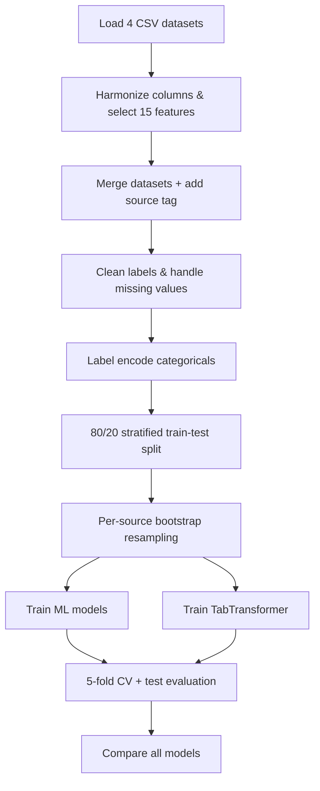

# Autism Spectrum Disorder (ASD) Early Detection

[](https://www.python.org/)
[](ASD_Detection.ipynb)
[](ASD_Detection.ipynb)

An intelligent screening framework for **early detection of Autism Spectrum Disorder (ASD)** using questionnaire-based data. The project combines **ensemble learning** (bagging and boosting) with **deep learning** (TabTransformer) to support reliable, data-driven screening across toddlers, children, adolescents, and adults.

The full pipeline is implemented in [`ASD_Detection.ipynb`](ASD_Detection.ipynb): data loading, preprocessing, model training, hyperparameter tuning, and performance comparison.

> **Disclaimer:** This system is intended for **research and educational purposes only**. It does not replace clinical diagnosis by a qualified healthcare professional. Always consult a licensed specialist for medical decisions.

---

## Table of Contents

- [Overview](#overview)
- [Problem Statement](#problem-statement)
- [Objectives](#objectives)
- [Datasets](#datasets)
- [Repository Structure](#repository-structure)
- [Notebook Pipeline](#notebook-pipeline)
- [Methodology](#methodology)
- [Models Implemented](#models-implemented)
- [Evaluation Metrics](#evaluation-metrics)
- [Results](#results)
- [Visualizations](#visualizations)
- [Technologies Used](#technologies-used)
- [Getting Started](#getting-started)
- [Usage](#usage)
- [License](#license)
- [Acknowledgments](#acknowledgments)

---

## Overview

This project builds a machine learning pipeline for ASD screening based on standardized questionnaire responses (AQ-10 style items). Four public datasets are harmonized, preprocessed, and used to train and compare six model families:

- **Bagging:** Random Forest, Extra Trees  
- **Boosting:** AdaBoost, XGBoost, LightGBM  
- **Deep learning:** TabTransformer (PyTorch Tabular)

After preprocessing **2,148** samples, models are evaluated on a held-out test set of **430** records with **5-fold cross-validation** on resampled training data.

---

## Problem Statement

Early diagnosis of Autism Spectrum Disorder is critical for timely intervention and better developmental outcomes. Traditional assessment is often **time-consuming** and requires **expert clinical evaluation**. This project explores whether questionnaire-based screening data, combined with modern ML and deep learning, can provide a **scalable supplementary screening** tool.

---

## Objectives

- Develop an intelligent ASD detection system using machine learning and deep learning
- Analyze questionnaire-based screening data across multiple age groups
- Harmonize heterogeneous datasets into a unified feature schema
- Apply preprocessing, per-source resampling, and label encoding
- Train bagging, boosting, and TabTransformer models
- Compare performance using accuracy, precision, recall, F1-score, ROC-AUC, and 5-fold CV

---

## Datasets

| Dataset | File | Raw Samples |
|---------|------|------------:|
| ASD Screening for Toddlers | `Toddler Autism dataset July 2018.csv` | 1,054 |
| Autism Child Dataset | `Autism_Child_Data.csv` | 292 |
| Autism Adolescent Dataset | `Autism_Adolescent_Data.csv` | 104 |
| Autism Adult Dataset | `Autism_Adult_Data.csv` | 704 |
| **Total (raw)** | | **2,154** |
| **After cleaning** | | **2,148** |

Six rows with invalid age values (`?`) are removed during preprocessing.

### Unified features (15 inputs)

| Feature | Description |
|---------|-------------|
| `A1_Score` – `A10_Score` | AQ-10 style questionnaire item scores |
| `age` | Age in years (toddler `Age_Mons` converted to years) |
| `gender` | Sex / gender |
| `ethnicity` | Ethnicity |
| `jundice` | Jaundice at birth |
| `austim` | Family history of ASD |

**Target:** `Class/ASD` → binary label (`NO` = 0, `YES` = 1)

---

## Repository Structure

```
ASD-Screening-ML-DL/
├── README.md
├── requirements.txt
├── ASD_Detection.ipynb          # Full training & evaluation pipeline
├── Toddler Autism dataset July 2018.csv
├── Autism_Child_Data.csv
├── Autism_Adolescent_Data.csv
└── Autism_Adult_Data.csv
```

Running the notebook also generates plot files (e.g. `fig1_class_distribution.png`, `fig8_model_comparison.png`).

---

## Notebook Pipeline

[`ASD_Detection.ipynb`](ASD_Detection.ipynb) is organized into these main sections:

| Section | Description |
|---------|-------------|
| **Data Set Loading** | Load four CSV files and inspect schema, shape, and class balance |
| **Data Preprocessing** | Column renaming, feature selection, merging, label cleaning, encoding |
| **Dataset Merging** | Concatenate datasets with a `source` tag (`child`, `adult`, `adolescent`, `screening`) |
| **Exploratory analysis** | Class distribution, age KDE plots, correlation heatmap |
| **Train / test split & resampling** | 80/20 stratified split; bootstrap resampling per source group |
| **Bagging models** | Random Forest, Extra Trees |
| **Boosting models** | AdaBoost, XGBoost (GridSearchCV), LightGBM (GridSearchCV) |
| **Deep learning** | TabTransformer via PyTorch Tabular |
| **Model comparison** | Test metrics, CV bar charts, hyperparameter heatmap |

---

## Methodology



### Preprocessing details

1. Rename toddler dataset columns to match child/adult/adolescent schema  
2. Convert toddler age from months to years (`Age_Mons / 12`)  
3. Normalize target labels to uppercase `YES` / `NO`  
4. Impute missing ethnicity (`?`) with mode  
5. Remove rows with invalid age  
6. Label-encode `gender`, `ethnicity`, `jundice`, `austim`  
7. Map target to binary: `NO → 0`, `YES → 1`

### Resampling strategy

| Pipeline | Samples per source | Total training rows |
|----------|-------------------:|--------------------:|
| **ML models** | 500 | 2,000 |
| **TabTransformer** | 2,500 | 10,000 |

Resampling uses `sklearn.utils.resample` with `random_state=42` on the **training split only** (test set stays untouched at **430** samples).

### Split configuration

- **Test size:** 20%  
- **Stratify:** by `Class/ASD`  
- **Random state:** 42

---

## Models Implemented

### Bagging algorithms

| Model | Key settings |
|-------|----------------|
| **Random Forest** | `n_estimators=200`, `random_state=42` |
| **Extra Trees** | `n_estimators=200`, `random_state=42` |

### Boosting algorithms

| Model | Key settings |
|-------|----------------|
| **AdaBoost** | `DecisionTreeClassifier(max_depth=1)`, `n_estimators=200`, `learning_rate=0.5` |
| **XGBoost** | Tuned via `GridSearchCV` (5-fold, 243 candidates) |
| **LightGBM** | Tuned via `GridSearchCV` (5-fold, 243 candidates) |

**Best XGBoost params:** `n_estimators=300`, `max_depth=2`, `learning_rate=0.2`, `subsample=0.7`, `colsample_bytree=0.8`

**Best LightGBM params:** `n_estimators=300`, `max_depth=2`, `learning_rate=0.2`, `subsample=0.7`, `colsample_bytree=0.7`

### Deep Learning — TabTransformer

| Setting | Value |
|---------|-------|
| Library | PyTorch Tabular |
| Attention heads | 8 |
| Attention blocks | 6 |
| Max epochs | 50 (main run); 30 (5-fold CV) |
| Batch size | 64 |
| Training rows | 10,000 (after resampling) |

---

## Evaluation Metrics

- Accuracy  
- Precision  
- Recall  
- F1-Score  
- ROC-AUC (TabTransformer)  
- **5-Fold Cross-Validation** (mean ± std)

---

## Results

### Test set performance (430 samples)

| Model | Test Accuracy | Mean 5-Fold CV Accuracy |
|-------|:-------------:|:-----------------------:|
| Random Forest | 0.930 | 0.871 |
| Extra Trees | 0.916 | 0.936 |
| AdaBoost | **1.000** | 0.978 |
| **XGBoost** | **0.986** | **0.970** |
| LightGBM | 0.984 | 0.933 |
| **TabTransformer (DL)** | **0.981** | **0.993** |

### TabTransformer — detailed metrics

| Metric | Test | 5-Fold CV (mean ± std) |
|--------|:----:|:----------------------:|
| Accuracy | 0.9814 | 0.9932 ± 0.0009 |
| Precision | 0.9865 | 0.9947 ± 0.0033 |
| Recall | 0.9777 | 0.9920 ± 0.0019 |
| F1-Score | 0.9821 | 0.9933 ± 0.0008 |
| ROC-AUC | — | 0.9989 ± 0.0003 |

### Key findings

- **TabTransformer** achieved the highest and most stable cross-validation accuracy (**99.3%**) with very low variance across folds.
- **XGBoost** delivered the strongest tuned boosting performance on the test set (**98.6%**) with excellent CV consistency (**97.0%**).
- **LightGBM** matched XGBoost closely on test accuracy (**98.4%**) after hyperparameter tuning.
- **AdaBoost** achieved the highest test accuracy on the evaluation dataset, while XGBoost, LightGBM, and TabTransformer demonstrated strong and consistent performance across validation folds.
- Bagging models (Random Forest, Extra Trees) provided solid baselines above **91%** test accuracy.

---

## Visualizations

The notebook generates visualizations for:
- Class distribution analysis
- Age distribution analysis
- Feature correlation analysis
- Confusion matrices
- Model performance comparison
- Cross-validation performance comparison
- Hyperparameter tuning results

---

## Technologies Used

| Category | Tools |
|----------|-------|
| Language | Python 3.9+ |
| Notebook | Jupyter / Google Colab |
| Data | Pandas, NumPy |
| ML | Scikit-learn, XGBoost, LightGBM |
| Deep learning | PyTorch, PyTorch Tabular, PyTorch Lightning |
| Visualization | Matplotlib, Seaborn |

---

## Getting Started

### Prerequisites

- Python 3.9 or higher  
- Jupyter Notebook or JupyterLab (or Google Colab)

### Installation

```bash
git clone https://github.com/<your-username>/<your-repo>.git
cd ASD-Screening-ML-DL
python -m venv venv
```

**Windows (PowerShell):**

```powershell
.\venv\Scripts\Activate.ps1
pip install -r requirements.txt
jupyter notebook
```

**macOS / Linux:**

```bash
source venv/bin/activate
pip install -r requirements.txt
jupyter notebook
```

Dependencies are listed in [`requirements.txt`](requirements.txt) (Pandas, scikit-learn, XGBoost, LightGBM, PyTorch, PyTorch Tabular, Matplotlib, Seaborn, Jupyter).

---

## Usage

### 1. Open the notebook

```bash
jupyter notebook ASD_Detection.ipynb
```

Or upload the folder to [Google Colab](https://colab.research.google.com/) and open `ASD_Detection.ipynb`.

### 2. Set dataset paths

The notebook defaults to Google Drive paths. For **local execution**, update the CSV paths in the loading cells:

```python
child = pd.read_csv("Autism_Child_Data.csv")
adult = pd.read_csv("Autism_Adult_Data.csv")
adolescent = pd.read_csv("Autism_Adolescent_Data.csv")
screening = pd.read_csv("Toddler Autism dataset July 2018.csv")
```

Apply the same change in the TabTransformer section if you run the deep learning cells separately.

### 3. Run all cells

Use **Run All** to execute the full pipeline:

1. Load and merge datasets  
2. Preprocess and encode features  
3. Split, resample, and train all six models  
4. Print metrics and save comparison plots  

Training XGBoost/LightGBM GridSearch and TabTransformer may take several minutes depending on your hardware. A GPU helps for the deep learning section but is not required.

### 4. Review outputs

- Classification reports and confusion matrices in notebook output  
- Saved PNG figures in the working directory  
- Final CV comparison chart ranking all models


## License

This project is released under the **MIT License**. See [LICENSE](LICENSE) for details. Dataset files may be subject to separate terms from their original publishers—verify before redistribution.

---

## Acknowledgments

- Public ASD screening datasets for toddlers, children, adolescents, and adults  
- Open-source libraries: scikit-learn, XGBoost, LightGBM, PyTorch, and PyTorch Tabular  

---

